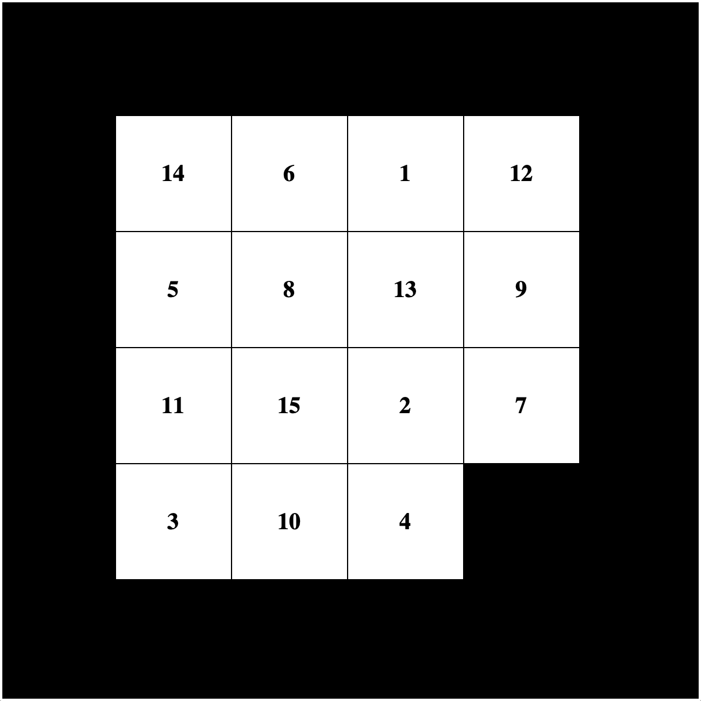

# Fifteen-Puzzle

A puzzle made with Tkinter graphical library. As Wikipedia puts it, "_The object of the puzzle is to place the tiles in order by making sliding moves that use the empty space_". **Download the code and try it out for yourself!**

